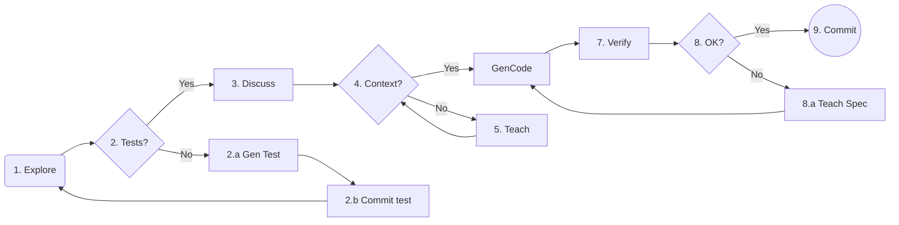

# SEN55-ILI9486 Air Quality Sensor

[](https://github.com/eastwillowlearninglog/SEN55-ILI9486-Air-Quality-Sensor/actions/workflows/arduino.yml)
[](https://github.com/eastwillowlearninglog/SEN55-ILI9486-Air-Quality-Sensor/actions/workflows/tests.yml)
[](https://github.com/eastwillowlearninglog/SEN55-ILI9486-Air-Quality-Sensor/actions/workflows/emulator.yml)
[](https://github.com/eastwillowlearninglog/SEN55-ILI9486-Air-Quality-Sensor/actions/workflows/integration-test.yml)
[](https://github.com/eastwillowlearninglog/SEN55-ILI9486-Air-Quality-Sensor/actions/workflows/wasm.yml)

## Main Goal

I want to demonstrate the newest ai agent workflow can handle the embedded c++project.

Now I have tested AI Agent Workflow:
- [jules](https://jules.google/)
- [antigravity](https://antigravity.google/)
- [openspec](https://github.com/Fission-AI/OpenSpec)

I want to propse a workflow that can handle the embedded c++project.

1. Create the Emulator or the mock for the embedded c++project.
2. Create the test for the embedded c++project.
3. Use the Below Workflow to achieve the goal.

## Project Goal

The main goal of this project is to create a display emulator for the SEN55 air quality sensor using the ILI9486 driver.

## My Company with AI Agent Workflow



* **1. Explore(`/opsx-explore` or `/opsx-new`)**
Identify the scope of changes and requirements for the new feature.
* **2. Check Tests Coverage**
Determine if the proposed changes are covered by existing unit tests.
  * Usually I will straight forward observe how the AI agent edit the code file.
* **2.a Gen Test**
Use the AI Agent to generate the necessary unit test code before implementation.
* **2.b Commit Test**
Use the AI Agent to commit the test code.
* **3. Discuss(`/opsx-continue`)**
Discuss the feature with the AI Agent to ensure it understands the requirements and logic.
* **4. Check Context(`/opsx-continue`)**
Assess if the AI Agent has sufficient project context to complete the task.
* **5. Teach & Spec(`/opsx-continue`)**
If context is lacking or verification failed, provide OpenSpec details or specific instructions to guide the AI.
* **6. Gen Code(`/opsx-apply`)**
Instruct the AI Agent to generate the implementation code for the new feature.
* **7. Verify(`/opsx-verify`)**
Review and verify the generated code and specifications against the requirements.
* **9. Commit**
  * Before commit i will use `/opsx-sync` to sync the spec and what i teach to local.
  * Then I will use `/opsx-archive` to archive the spec and what i teach to local.
  * Then I will use `git commit` to commit the code.

## How to Run

Local Run Command :

```bash
mkdir build
cd build
cmake ..
cmake --build .
./DisplayEmulator
```

Local Run Test Command :

```bash
gh extension install https://github.com/nektos/gh-act
gh act push
```

Web mockup Display:
[https://eastwillow.github.io/SEN55-ILI9486-Air-Quality-Sensor/](https://eastwillow.github.io/SEN55-ILI9486-Air-Quality-Sensor/)

Software Bill of Materials:
* ILI9486 Driver Form [3.5inch TFT Touch Shield](https://www.waveshare.com/wiki/3.5inch_TFT_Touch_Shield)
* SEN55 Library From [arduino-i2c-sen5x](https://github.com/Sensirion/arduino-i2c-sen5x)
* SEN55 Library Depency From [arduino-core](https://github.com/Sensirion/arduino-core)


Acknowledging AI Usage:
* Code assistance and debugging for the LCD driver and SEN55 implementation provided by Google's Gemini.

---

## Testing Strategy

This project uses a layered testing approach to validate different aspects of the system. Understanding the separation between test types is critical for maintaining test clarity and avoiding redundancy.

### Test Pyramid

```
    △ Smoke Tests (Binary Integration)
   △△ Integration Tests (Visual Regression - Future)  
  △△△ Component Tests (CoreLib Validation)
```

### Test Layer Separation

| Test Type | Workflow | Target | Purpose | xvfb-run Required? |
|-----------|----------|--------|---------|-------------------|
| **Smoke Tests** | `emulator.yml` | DisplayEmulator binary | "Can it run without crashing?" | ✅ Yes |
| **Component Tests** | `tests.yml` | CoreLib library | "Do components work correctly?" | ✅ Yes |
| **Integration Tests** | `integration-test.yml` | Screenshot comparison | "Does it render correctly?" | ✅ Yes |
| **Compile Checks** | `arduino.yml` | Arduino sketch | "Does it compile?" | ❌ No |

### Why Both Smoke and Component Tests Need xvfb-run?

**Mental Model**: `xvfb-run = SDL2 = GUI` 

Both test types use SDL2, but at different abstraction layers:

- **Smoke test** (`emulator.yml`): Runs the full DisplayEmulator binary → SDL2_Init() in main application
- **Component test** (`tests.yml`): Links CoreLib → Tests call LCD_Driver_SDL functions → SDL2 functions

Both require a display, so both need `xvfb-run` in headless CI environments.

### Component Tests vs Smoke Tests

**Component tests** (`tests/emulator_test.cpp`):
- Link CoreLib library directly
- Test individual components: `App_Setup()`, `SensorMock`, display functions
- Enable white-box testing and granular debugging
- Fast execution (~0.2s)

**Smoke tests** (`emulator.yml`):
- Execute the final DisplayEmulator binary
- Validate full integration and SDL2 initialization
- Black-box validation of overall system health
- Slower execution (~5s)

### Running Tests Locally

**Component Tests** (links CoreLib):
```bash
# Build standalone tests
cmake -S tests -B build_tests
cmake --build build_tests

# Run with xvfb-run (required for SDL2)
xvfb-run ctest --test-dir build_tests --output-on-failure
```

**Smoke Test** (runs binary):
```bash
# Build main project
mkdir -p build && cd build
cmake ..
cmake --build .

# Run emulator in test mode with xvfb-run
xvfb-run ./DisplayEmulator --test
```

### CI Workflows

All test workflows are in `.github/workflows/`:

- **`tests.yml`**: Component tests (CoreLib validation)
- **`emulator.yml`**: Smoke tests (binary execution)
- **`integration-test.yml`**: Integration tests (visual regression)
- **`arduino.yml`**: Compilation checks (no xvfb-run needed)
- **`wasm.yml`**: WASM build and deployment (no xvfb-run needed)

---

## Emulator Testing

The DisplayEmulator supports multiple testing modes to validate both execution and rendering correctness.

### 1. Interactive Mode (Local Development)
Run the emulator without any arguments to start an interactive session with mouse/keyboard input.

```bash
./build/DisplayEmulator
```

**Use Case**: Manual UI testing, visual inspection, interaction debugging.

---

### 2. Test Mode (CI Smoke Test)
Run the emulator with the `--test` flag for automated execution validation.

```bash
./build/DisplayEmulator --test
```

**Behavior**:
- Runs for exactly 25 frames (deterministic duration)
- Captures final screen to `screenshot.bmp`
- Exits automatically with code 0 on success
- Validated in CI via `.github/workflows/emulator.yml`

**Purpose**: Smoke test ensuring the emulator can execute in headless CI environments (xvfb-run) without crashes. This validates SDL2 initialization, basic rendering loops, and screenshot generation. **Does not validate rendering correctness** - see Integration Tests below.

---

### 3. Integration Testing (Visual Regression)
Visual regression testing via GTest-controlled checkpoint execution.

**Workflow** (`integration-test.yml`):
- Programmatic control via `EmulatorEngine` and GTest
- Multi-checkpoint screenshot capture (Startup and Final)
- Pixel-level comparison against reference images (ImageMagick)
- Artifact upload on regression detection

**Purpose**: Ensure UI renders correctly by detecting visual regressions through automated screenshot comparison.

**Run Locally**:
```bash
# Build
cd build && cmake .. && cmake --build . --target display_integration_test

# Run checks
xvfb-run -a ./tests/display_integration_test
```

**Documentation**: See `openspec/specs/display-integration-test/spec.md` for detailed requirements.

